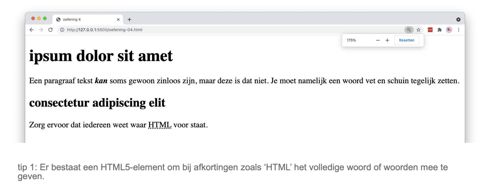

# abbreviation

## Leerdoelen

* `<strong>` en `<em>` combineren op hetzelfde stuk tekst
* een afkorting verklaren met `<abbr>` en het `title`-attribuut

## Functionele analyse

De pagina bestaat uit een hoofdtitel met een paragraaf en een subtitel met een paragraaf. In de eerste paragraaf staat één woord tegelijk vet én schuin. In de tweede paragraaf staat de afkorting HTML. Wanneer je met de muis over die afkorting gaat, verschijnt de volledige betekenis.

## Technische analyse

Vertrek van een leeg `index.html`-bestand en bouw de basisstructuur van een HTML-document op. Geef het document de titel `abbreviation`.

Gebruik `<h1>` voor de hoofdtitel, `<h2>` voor de subtitel en `
` voor de lopende tekst.

Tips:

1. Om een woord tegelijk vet en schuin te zetten, nest je twee elementen in elkaar. Let erop dat je ze in de juiste volgorde opent en sluit.
2. Er bestaat een HTML5-element om bij afkortingen zoals 'HTML' het volledige woord of de volledige woorden mee te geven.
3. HTML staat voor HyperText Markup Language.

## Copy

- ipsum dolor sit amet
- Een paragraaf tekst kan soms gewoon zinloos zijn, maar deze is dat niet. Je moet namelijk een woord vet en schuin tegelijk zetten.
- consectetur adipiscing elit
- Zorg ervoor dat iedereen weet waar HTML voor staat.

## Verwacht resultaat

