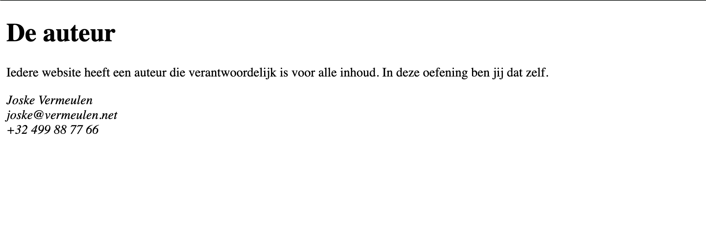

# address

## Leerdoelen

* contactgegevens van de auteur semantisch correct plaatsen met `<address>`
* een regeleinde invoegen met ` `

## Functionele analyse

De pagina toont een titel, een korte uitleg en daaronder de contactgegevens van de auteur: naam, e-mailadres en telefoonnummer, elk op een eigen regel. De browser toont die gegevens standaard schuin.

## Technische analyse

Vertrek van een leeg `index.html`-bestand en bouw de basisstructuur van een HTML-document op. Geef het document de titel `address`.

Gebruik `<h1>` voor de titel en `
` voor de paragraaf.

Tips:

1. Er bestaat een HTML-element om de contactinformatie van de auteur van een pagina aan te duiden.
2. Witruimte en regeleindes in je code worden door de browser samengevouwen (white space collapsing). Gebruik ` ` om de drie gegevens elk op een eigen regel te krijgen.
3. Vervang de gegevens van Joske Vermeulen gerust door je eigen gegevens.

## Copy

- De auteur
- Iedere website heeft een auteur die verantwoordelijk is voor alle inhoud. In deze oefening ben jij dat zelf.
- Joske Vermeulen
- joske@vermeulen.net
- +32 499 88 77 66

## Verwacht resultaat

