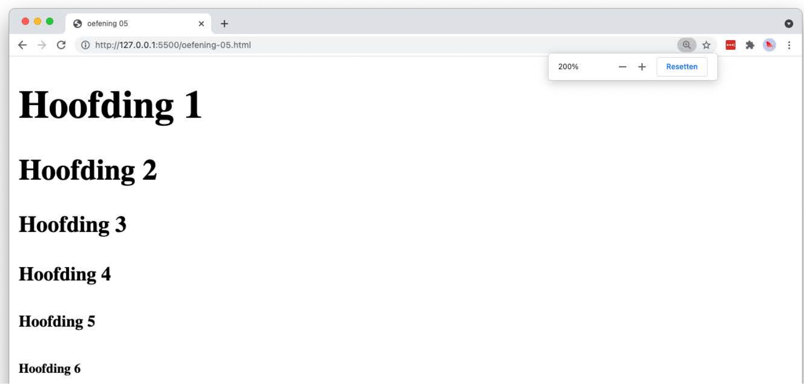

# headings

## Leerdoelen

* de zes niveaus van titels in HTML kennen
* zien hoe een browser elk titelniveau standaard weergeeft

## Functionele analyse

De pagina toont de zes titelniveaus van HTML onder elkaar. Elke titel wordt door de browser standaard kleiner weergegeven dan de vorige.

## Technische analyse

Vertrek van een leeg `index.html`-bestand en bouw de basisstructuur van een HTML-document op. Geef het document de titel `headings`.

Plaats de zes titelelementen (`<h1>` tot en met `<h6>`) onder elkaar in de `<body>`.

Je hoeft hier zelf niets op te maken. De verschillen in grootte en dikte komen uit de standaardinstellingen van de browser.

## Copy

- Hoofding 1
- Hoofding 2
- Hoofding 3
- Hoofding 4
- Hoofding 5
- Hoofding 6

## Verwacht resultaat

