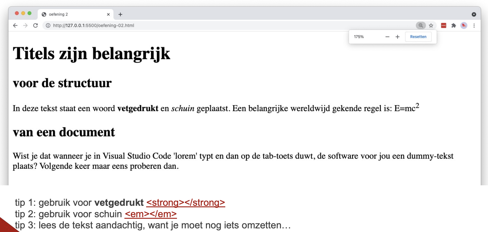

# markup

## Leerdoelen

* tekst binnen een paragraaf benadrukken met `<strong>` en `<em>`
* een bovenschrift plaatsen met ``

## Functionele analyse

De pagina bestaat uit een hoofdtitel, gevolgd door twee onderdelen die elk een subtitel en een paragraaf bevatten. In de eerste paragraaf staat één woord vetgedrukt, één woord schuin en staat er een formule met een bovenschrift.

## Technische analyse

Vertrek van een leeg `index.html`-bestand en bouw de basisstructuur van een HTML-document op. Geef het document de titel `markup`.

Gebruik `<h1>` voor de hoofdtitel, `<h2>` voor de subtitels en `
` voor de lopende tekst.

Tips:

1. Gebruik voor **vetgedrukt** het `<strong>`-element.
2. Gebruik voor *schuin* het `<em>`-element.
3. Lees de tekst aandachtig, want je moet nog iets omzetten. De `2` in `E=mc2` hoort als bovenschrift te staan.

## Copy

- Titels zijn belangrijk
- voor de structuur
- In deze tekst staat een woord vetgedrukt en schuin geplaatst. Een belangrijke wereldwijd gekende regel is: E=mc2
- van een document
- Wist je dat wanneer je in Codium 'lorem' typt en dan op de tab-toets duwt, de software voor jou een dummy-tekst plaats? Volgende keer maar eens proberen dan.

## Verwacht resultaat

