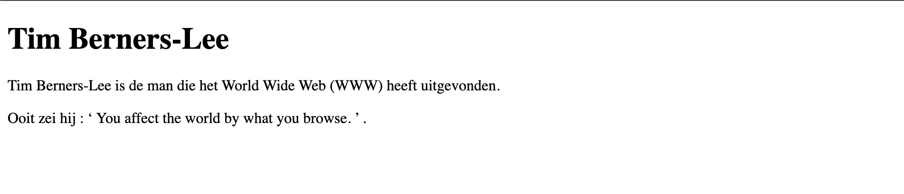

# quote

## Leerdoelen

* een citaat in lopende tekst correct opmaken met `<q>`
* de bron van een citaat meegeven met het `cite`-attribuut

## Functionele analyse

De pagina toont een korte tekst over Tim Berners-Lee. In de tweede paragraaf staat een uitspraak van hem, verwerkt in de lopende tekst. De browser plaatst zelf de aanhalingstekens rond dat citaat.

## Technische analyse

Vertrek van een leeg `index.html`-bestand en bouw de basisstructuur van een HTML-document op. Geef het document de titel `quote`.

Gebruik `<h1>` voor de titel en `
`-elementen voor de twee paragrafen.

Tips:

1. Het citaat staat middenin je eigen zin, dus gebruik je een inline citaat en geen blokcitaat.
2. Typ zelf geen aanhalingstekens. Die worden door de browser toegevoegd.
3. Vermeld de bron van het citaat via het `cite`-attribuut.

## Copy

- Tim Berners-Lee
- Tim Berners-Lee is de man die het World Wide Web (WWW) heeft uitgevonden.
- Ooit zei hij: You affect the world by what you browse.

## Links

- https://www.brainyquote.com/quotes/tim_bernerslee_100459

## Verwacht resultaat

