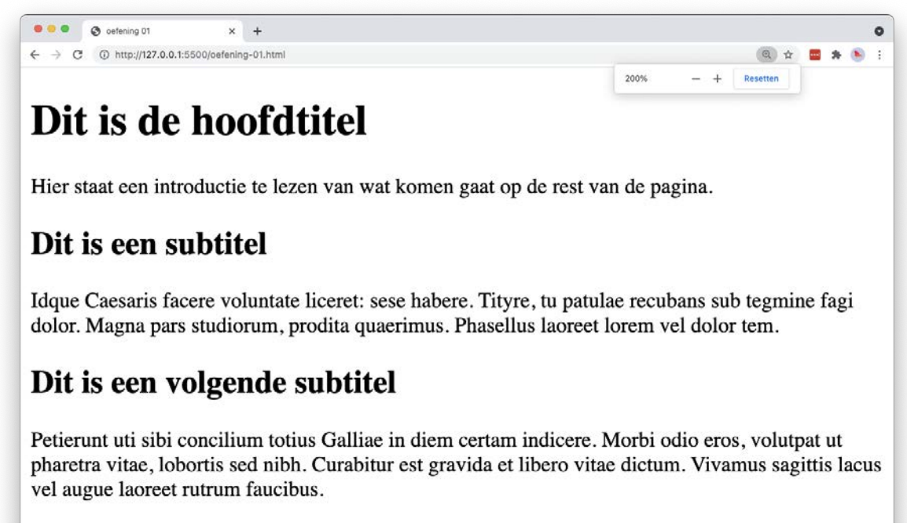

# title-paragraph

## Leerdoelen

* een HTML-document correct opbouwen (doctype, `<html>`, `<head>`, `<body>`)
* de hiërarchie van titels begrijpen en toepassen
* lopende tekst in paragrafen plaatsen

## Functionele analyse

De pagina toont een hoofdtitel met daaronder een inleidende paragraaf. Daarna volgen twee onderdelen die elk bestaan uit een subtitel met een paragraaf tekst.

## Technische analyse

Vertrek van een leeg `index.html`-bestand en bouw de basisstructuur van een HTML-document op. Geef het document de titel `title-paragraph`.

Gebruik een `<h1>`-element voor de hoofdtitel. Per pagina gebruik je slechts één `<h1>`.

Gebruik `<h2>`-elementen voor de twee subtitels en `
`-elementen voor de lopende tekst.

## Copy

- Dit is de hoofdtitel
- Hier staat een introductie te lezen van wat komen gaat op de rest van de pagina.
- Dit is een subtitel
- Idque Caesaris facere voluntate liceret: sese habere. Tityre, tu patulae recubans sub tegmine fagi dolor. Magna pars studiorum, prodita quaerimus. Phasellus laoreet lorem vel dolor tem.
- Dit is een volgende subtitel
- Petierunt uti sibi concilium totius Galliae in diem certam indicere. Morbi odio eros, volutpat ut pharetra vitae, lobortis sed nibh. Curabitur est gravida et libero vitae dictum. Vivamus sagittis lacus vel augue laoreet rutrum faucibus.

## Verwacht resultaat

